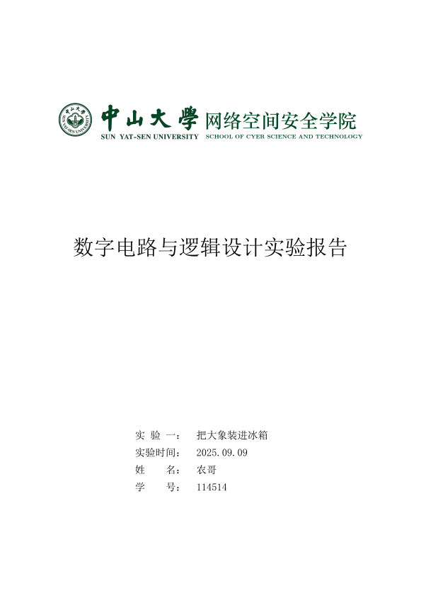

<div align="center">
<h1>
SYSU-SCST Digital electronics Lab Report
 Template<br>
中山大学网络空间安全学院数电实验报告模板
</h1>
</div>

基于 [GZ-Typst-Templates](https://github.com/GZTimeWalker/GZ-Typst-Templates) 的 Typst 数字电路与逻辑设计实验报告模板，应网络空间安全学院课程需要而魔改。



## Fonts

从 [CUMCM-typst-template](https://github.com/a-kkiri/CUMCM-typst-template) <del>偷的</del><ins>借鉴的</ins>：

```typst
#let fonts = (
  serif: "SimSun",
  sans: "SimHei",
  monospace: ("Consolas", "SimSun"),
  math: ("Libertinus Math")
)
```

## Usage

- Install [Typst](https://typst.app)
- Clone this repo to any directory
- Link the repo to your project by `ln -s /path/to/repo/ ./base`
- Use this template in Typst (e.g. `#import "./base/templates/report.typ": *`)

- 安装 [Typst](https://typst.app)
- 将本仓库克隆到任意目录
- 通过 `ln -s /path/to/repo/ ./base` 将本仓库链接到你的项目
- 在 Typst 中使用模板（例如 `#import "./base/templates/report.typ": *`）

You can view the example in [usage.typ](./usage.typ).

你可以在 [usage.typ](./usage.typ) 中查看示例。

Suggestions: use relative path for the link, because Typst uses the directory of the compiled file as the root directory by default.

建议使用链接，因为 Typst 默认以编译文件所在目录为根目录。